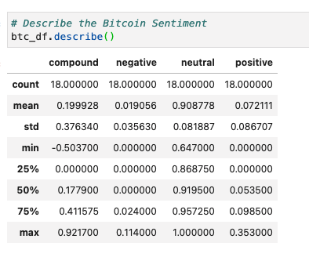
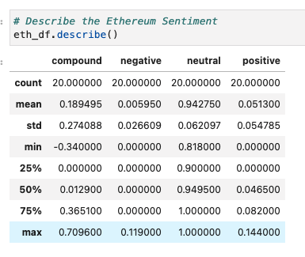

# Tales from the Crypto (Assignment)

In this assignment, I was asked to apply natural language processing to understand the sentiment in the latest news articles featuring Bitcoin and Ethereum. Morepver, applying fundamental NLP techniques to better understand the other factors involved with the coin prices such as common words and phrases, organizations,  and entities mentioned in the articles by using the following techniques:

1. [Sentiment Analysis](#Sentiment-Analysis)
2. [Natural Language Processing](#Natural-Language-Processing)
3. [Named Entity Recognition](#Named-Entity-Recognition)

#### **According to the Sentiment Analysis of Bitcoin and Ethereum news indicates that Bitcoin outperform Ethereum by having the highest average score at 0.051. It also receives higher positive score and compound score.**

